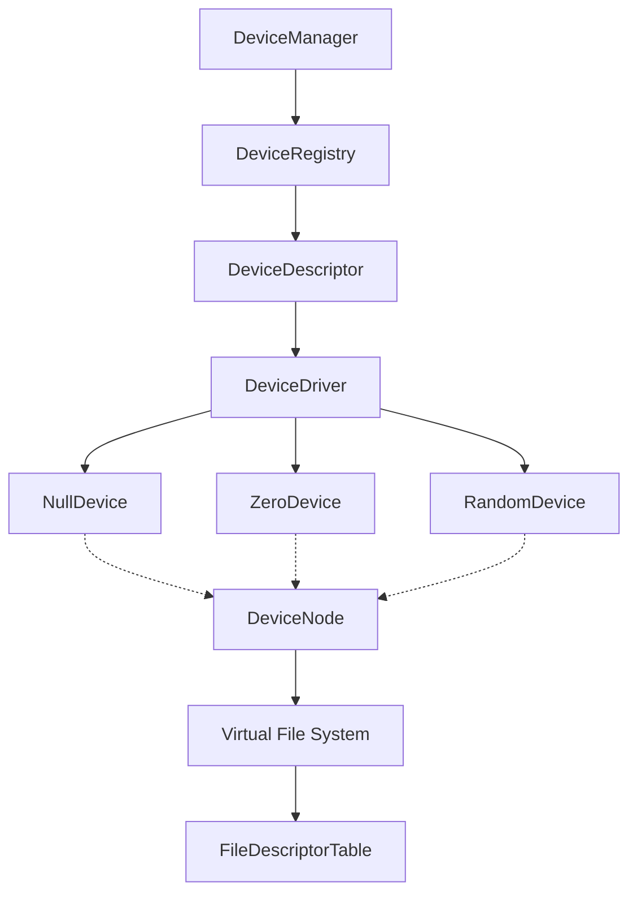
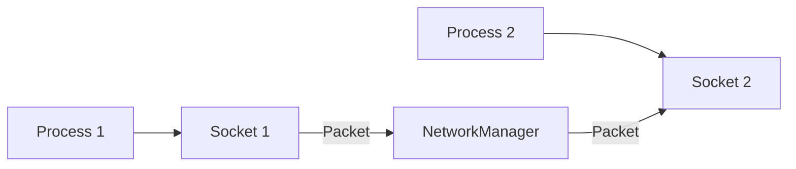
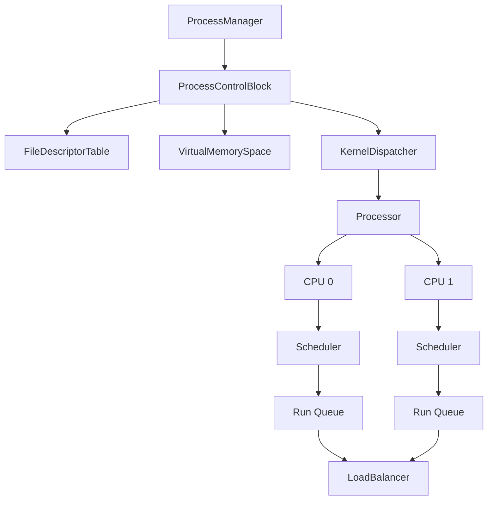
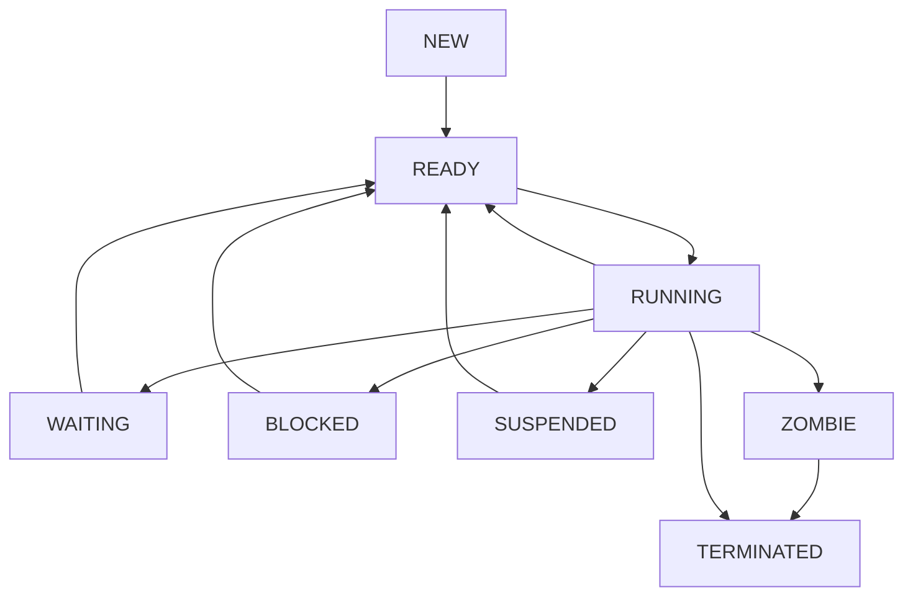
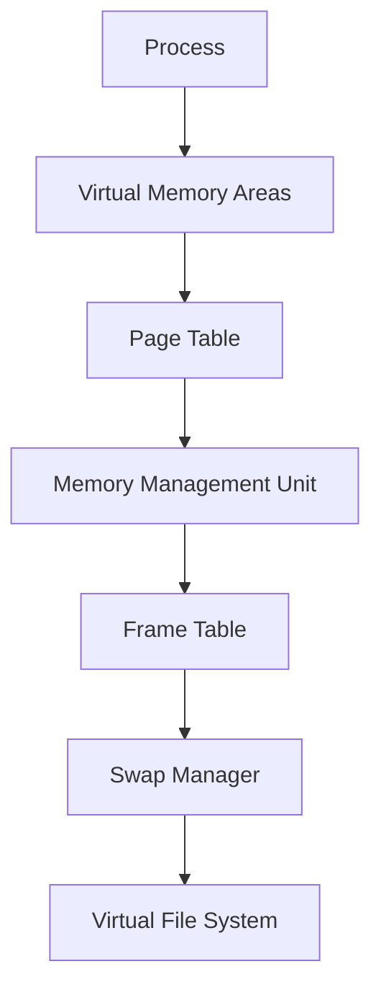

# Java Virtual OS Architecture

This document provides a high-level overview of the major subsystems within the Java Virtual OS simulator. The architecture is designed to reflect real-world operating system concepts (like VFS, IPC, Networking, Memory Management, and Device Management) using clean, decoupled Java patterns (Events, Registries, and Facades).

## Device Management Subsystem

**Purpose:** Provides a unified hardware abstraction layer, allowing the virtual OS to interact with simulated devices (like `/dev/null`, `/dev/zero`, `/dev/random`) without exposing driver implementations directly to user-space code.

**Key Components:**
- `DeviceManager`: Coordinates device registration, VFS mounting, and global subsystem statistics.
- `DeviceRegistry`: Thread-safe registry mapping names to `DeviceDriver` instances.
- `DeviceDescriptor`: Contains metadata (vendor, capabilities, state) for a given device.
- `DeviceDriver`: Interface for simulated hardware.

**Architecture Diagram:**



## Virtual File System (VFS)

**Purpose:** Provides a unified tree-based hierarchy for all files, directories, and devices, serving as the single entry point for I/O operations.

**Key Components:**
- `FileSystemManager`: Root coordinator of the file system.
- `PathResolver`: Translates absolute and relative paths to internal VFS nodes.
- `VfsNode` (Abstract): Base element representing a tree node.
- `DirectoryNode`, `FileNode`, `DeviceNode`: Concrete node implementations.

**Architecture Diagram:**

```mermaid
flowchart TD
    FSM[FileSystemManager]
    PR[PathResolver]
    VN[VfsNode]
    DirN[DirectoryNode]
    FileN[FileNode]
    DevN[DeviceNode]
    
    FSM --> PR
    PR --> VN
    VN <|-- DirN
    VN <|-- FileN
    VN <|-- DevN
```

## Networking Subsystem

**Purpose:** Simulates a TCP/IP networking stack allowing local inter-socket communication without binding to the host machine's actual network stack.

**Key Components:**
- `NetworkManager`: Routes packets internally based on routing tables.
- `VirtualSocket`: Descriptor type representing a simulated network connection.
- `PortManager`: Tracks bound ports to prevent collisions.

**Architecture Diagram:**



## Process Management & CPU Scheduling

**Purpose:** Simulates a multi-tasking kernel by managing process lifecycles (PID allocation, states, execution) and scheduling virtual CPU cycles.

**Key Components:**
- `ProcessManager`: Global registry of all virtual processes.
- `ProcessControlBlock (PCB)`: Metadata struct for a process (State, PID, UID, Memory Limits).
- `SchedulerSimulator`: Demonstrates CPU scheduling (e.g., Round Robin, FCFS).

**Architecture Diagram:**



**Process Lifecycle Diagram:**



## Memory Management

**Purpose:** Simulates both physical memory (allocation, metrics) and virtual memory (MMU, paging, page faults).

**Key Components:**
**Key Components:**
- `MemoryManagementUnit`: Translates virtual to physical addresses, generates page faults.
- `FrameTable`: Tracks physical memory allocation.
- `SwapManager`: Evicts and loads pages to/from the VirtualFileSystem.
- `VirtualMemoryArea`: Logical memory regions mapped to processes.

**Architecture Diagram:**



---

*This document is auto-generated and maintained alongside the Java Virtual OS implementation.*
