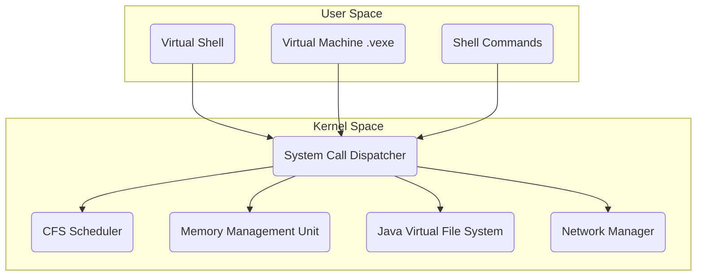

# Architecture of Java Virtual OS

The Java Virtual OS is designed as a simulated monolithic kernel running within a JVM. It provides a multi-tasking environment, simulated memory management, and a persistent filesystem.

## Core Subsystems

### 1. Process Management & Scheduler
- **ProcessManager:** Handles the creation, tracking, and lifecycle of simulated processes (PCBs).
- **Scheduler (CFS):** A Completely Fair Scheduler allocates CPU time blocks to processes via a `KernelDispatcher`.

### 2. Memory Management Unit (MMU)
- **Virtual Memory:** Simulates paged memory translation and handles Page Faults.
- **SwapManager:** Swaps inactive pages to a disk file when RAM is full.

### 3. Java Virtual File System (JVFS)
- **SuperBlock & Inodes:** Custom filesystem implementing ext2-like structures.
- **Persistence:** Writes to a simulated block device (`vdisk.img`).

### 4. Virtual Machine
- **ExecutableLoader:** Parses `.vexe` assembly text.
- **Virtual CPU:** Executes opcodes (LOAD, ADD, CMP, SYSCALL) and routes OS interactions through the `SystemCallDispatcher`.

## User Space vs Kernel Space

